# GEO资产库业务流程图与数据流程图

## 文档信息
- 文档版本：V1.0
- 创建日期：2025年1月
- 文档类型：流程设计文档

---

## 一、总体业务流程

### 1.1 核心业务流程总览

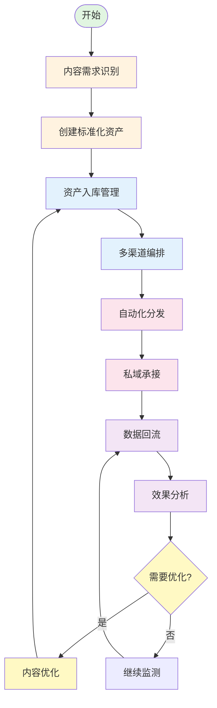

### 1.2 端到端业务流程

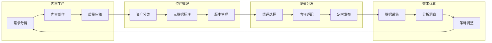

---

## 二、建库模块业务流程

### 2.1 资产创建流程

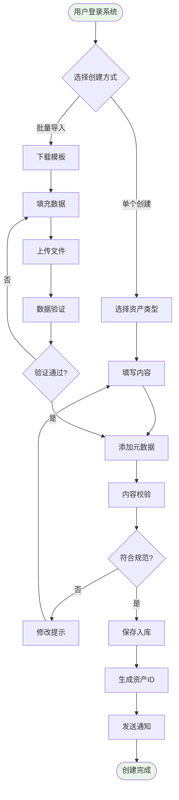

### 2.2 资产关联管理流程

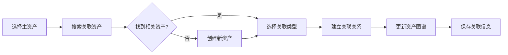

---

## 三、编排模块业务流程

### 3.1 智能编排流程

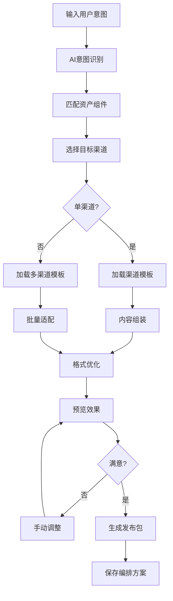

### 3.2 多渠道适配流程

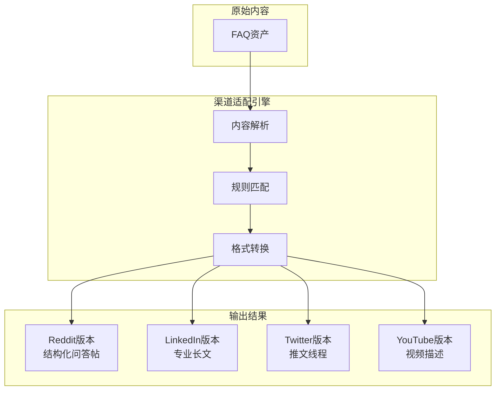

---

## 四、分发模块业务流程

### 4.1 自动发布流程

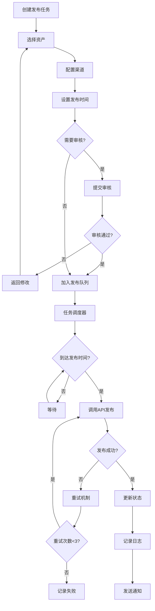

### 4.2 手动发布辅助流程

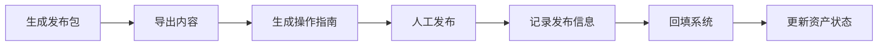

---

## 五、承接模块业务流程

### 5.1 Action Card触发流程

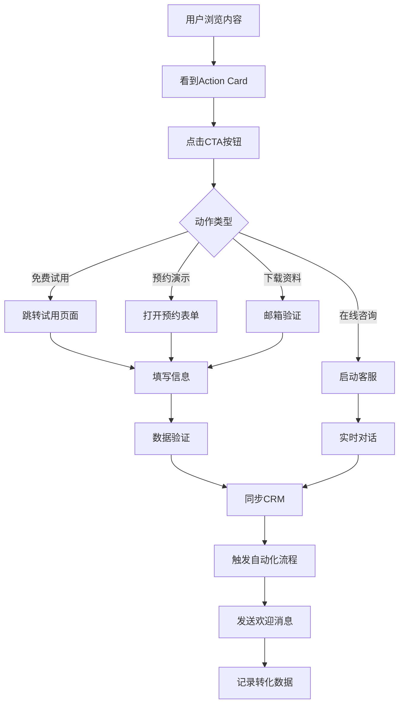

### 5.2 私域承接流程

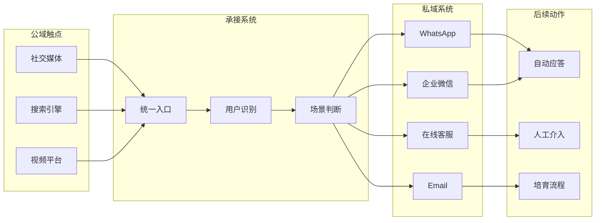

---

## 六、回流模块数据流程

### 6.1 数据采集流程

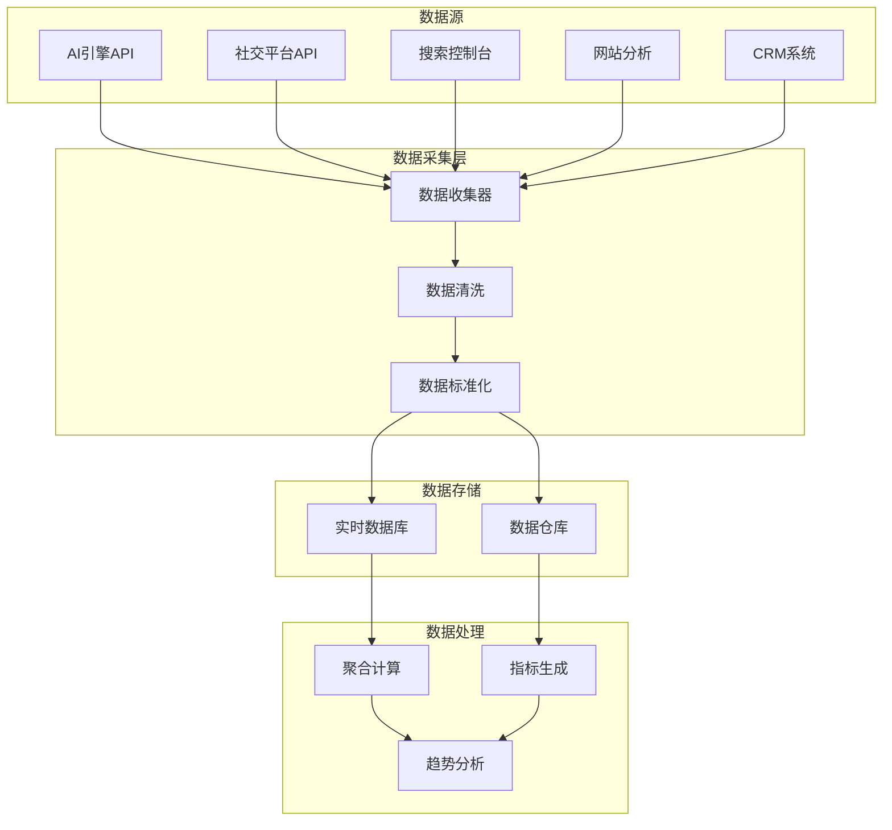

### 6.2 数据分析流程

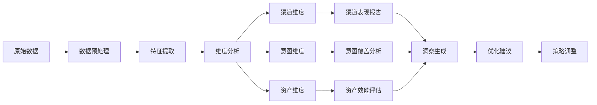

---

## 七、优化模块业务流程

### 7.1 A/B测试流程

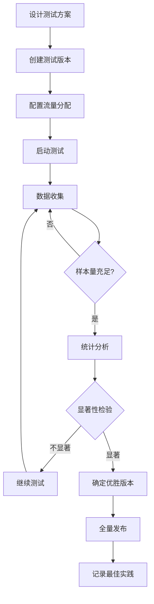

### 7.2 资产生命周期管理流程

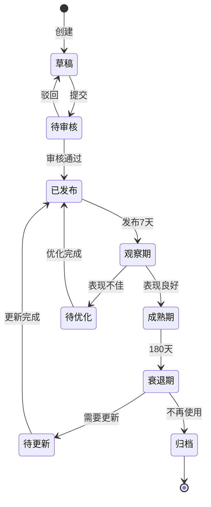

---

## 八、系统集成数据流

### 8.1 外部系统集成流程

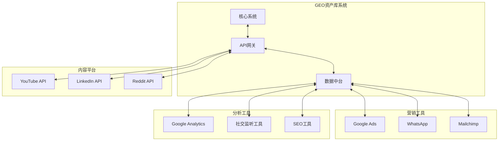

### 8.2 内部数据流转

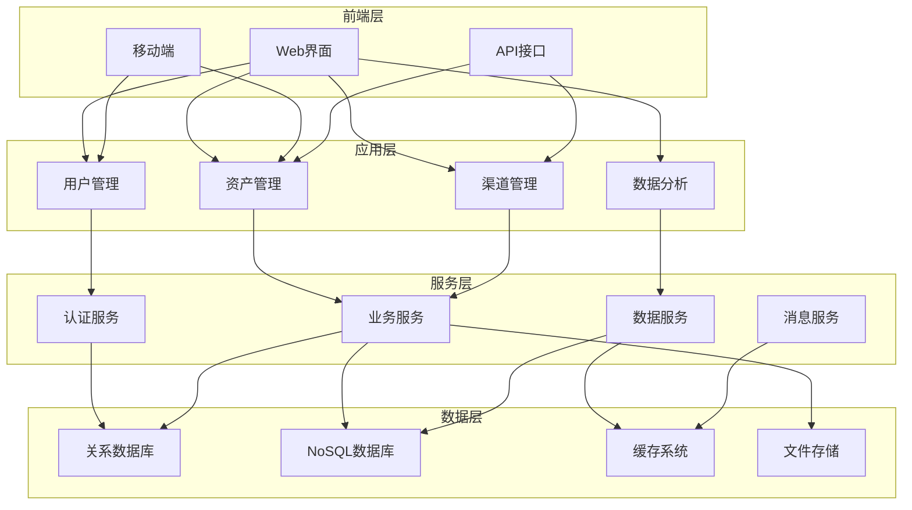

---

## 九、用户操作流程

### 9.1 内容运营人员工作流

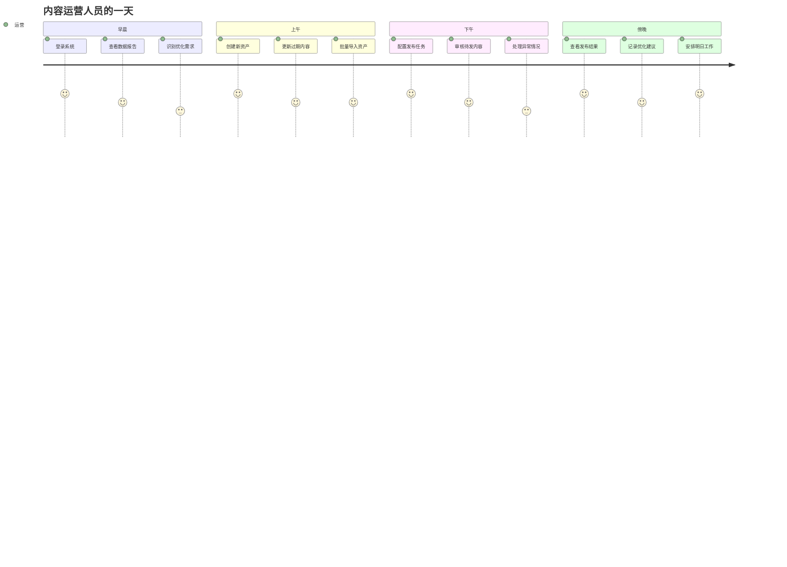

### 9.2 数据分析师工作流

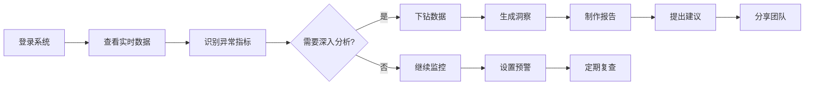

---

## 十、异常处理流程

### 10.1 发布失败处理

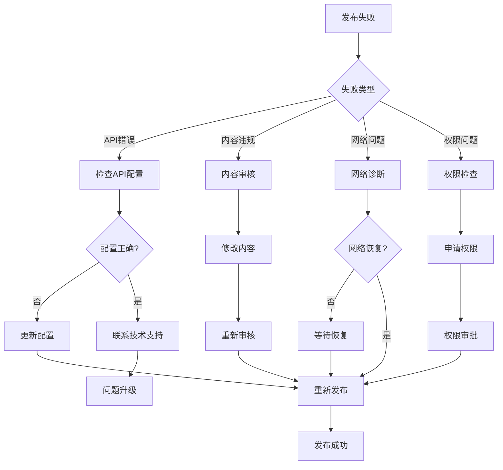

### 10.2 数据异常处理

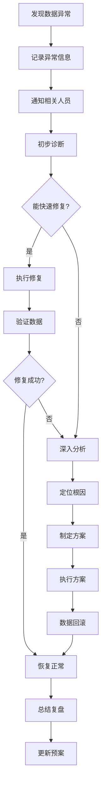

---

## 十一、性能优化流程

### 11.1 系统性能监控流程

```mermaid
graph TB
    subgraph 监控指标
        A1[响应时间]
        A2[并发数]
        A3[错误率]
        A4[资源使用率]
    end
    
    subgraph 告警机制
        B1[阈值设置]
        B2[实时监控]
        B3[告警触发]
        B4[通知发送]
    end
    
    subgraph 优化动作
        C1[性能分析]
        C2[瓶颈定位]
        C3[优化实施]
        C4[效果验证]
    end
    
    A1 --> B1
    A2 --> B1
    A3 --> B1
    A4 --> B1
    B1 --> B2
    B2 --> B3
    B3 --> B4
    B4 --> C1
    C1 --> C2
    C2 --> C3
    C3 --> C4
    C4 --> B2
```

---

## 十二、安全控制流程

### 12.1 访问控制流程

```mermaid
flowchart TD
    A[用户请求] --> B[身份认证]
    B --> C{认证成功?}
    C -->|否| D[拒绝访问]
    C -->|是| E[权限检查]
    E --> F{有权限?}
    F -->|否| D
    F -->|是| G[访问日志]
    G --> H[允许访问]
    H --> I[操作审计]
    D --> J[安全告警]
```

### 12.2 数据安全流程

```mermaid
graph LR
    subgraph 数据输入
        A[用户上传]
        B[API接入]
        C[批量导入]
    end
    
    subgraph 安全处理
        D[数据验证]
        E[恶意检测]
        F[数据加密]
        G[备份存储]
    end
    
    subgraph 数据使用
        H[授权访问]
        I[加密传输]
        J[使用审计]
    end
    
    A --> D
    B --> D
    C --> D
    D --> E
    E --> F
    F --> G
    G --> H
    H --> I
    I --> J
```

---

## 总结

本文档详细描述了GEO资产库内容操作系统的：

1. **业务流程**：覆盖从内容创建到优化的完整生命周期
2. **数据流程**：展示了数据在系统内外的流转路径
3. **用户流程**：描述了不同角色的操作流程
4. **异常处理**：提供了问题处理的标准流程
5. **系统集成**：说明了与外部系统的交互方式

这些流程图为系统开发、使用和维护提供了清晰的指导，确保各方对系统运作有统一的理解。

---

*最后更新：2025年1月*  
*版权所有 © GEO资产库运营团队*