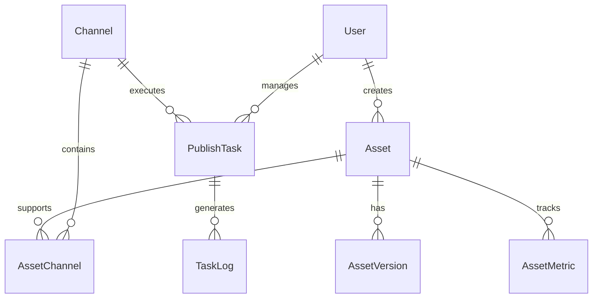

# GEO资产库内容操作系统需求说明书

## 文档信息
- 文档版本：V1.0
- 编制日期：2025年1月
- 文档状态：正式版
- 适用项目：GEO资产库内容操作系统

---

## 一、项目概述

### 1.1 项目背景
在AI驱动的内容生态下，企业面临着内容分散、渠道割裂、效果难以衡量的挑战。传统的内容管理方式无法适应全渠道、智能化的运营需求，亟需一套能够实现内容资产化、分发自动化、效果可视化的操作系统。

### 1.2 项目目标
构建一套全渠道内容操作系统，实现：
- 内容的标准化管理和资产化运营
- 多渠道的自动化分发和智能适配
- 全链路的数据监测和效果归因
- 基于数据反馈的持续优化迭代

### 1.3 项目范围
- **包含**：内容资产管理、多渠道编排分发、私域承接、数据回流分析、优化管理
- **不包含**：内容原创工具、视频制作工具、直播系统

### 1.4 术语定义
| 术语 | 定义 |
|------|------|
| GEO | Generative Engine Optimization，生成式引擎优化 |
| 资产 | 标准化、可复用的内容单元 |
| DAM | Digital Asset Management，数字资产管理 |
| 编排 | 将资产组装成适合特定渠道的内容包 |
| Action Card | 引导用户执行特定动作的功能卡片 |
| E-E-A-T | Experience, Expertise, Authoritativeness, Trustworthiness |

---

## 二、业务需求

### 2.1 业务目标需求

#### BR-001：内容资产化管理
- **需求描述**：将分散的内容转化为标准化、可复用的数字资产
- **业务价值**：降低内容生产成本80%，提高内容复用率10倍
- **成功标准**：
  - 内容资产化率达到95%以上
  - 单个资产平均复用次数超过50次/月
  - 内容更新周期缩短至3天内

#### BR-002：全渠道统一运营
- **需求描述**：实现一次创作、多渠道分发的内容运营模式
- **业务价值**：渠道运营效率提升5倍，人力成本降低60%
- **成功标准**：
  - 支持20+主流渠道
  - 分发自动化率达到80%
  - 渠道内容一致性达到95%

#### BR-003：数据驱动优化
- **需求描述**：建立完整的内容效果监测和优化体系
- **业务价值**：ROI提升200%，CAC降低50%
- **成功标准**：
  - AI引用率提升至30%
  - 转化率提升50%
  - 数据回流实时性<1小时

### 2.2 用户角色需求

| 角色 | 需求描述 | 使用频率 |
|------|---------|---------|
| 内容运营 | 创建、编辑、发布内容资产 | 每日 |
| 渠道管理 | 配置渠道、管理发布任务 | 每日 |
| 数据分析师 | 监测数据、生成报表、优化建议 | 每日 |
| 系统管理员 | 用户管理、权限配置、系统维护 | 每周 |
| 外部合作方 | 查看指定内容、有限编辑权限 | 按需 |

### 2.3 业务流程需求

#### 核心业务流程
```
内容创建 → 资产入库 → 渠道编排 → 自动分发 → 
私域承接 → 数据回流 → 效果分析 → 优化迭代
```

---

## 三、功能需求

### 3.1 建库模块需求

#### FR-101：资产类型管理
**需求级别**：必须实现
**功能描述**：
- 支持10类标准资产类型的创建和管理
- 每类资产有独立的模板和验证规则
- 支持自定义扩展资产类型

**详细要求**：
| 资产类型 | 字段要求 | 验证规则 |
|---------|---------|----------|
| FAQ卡 | 问题、答案、关键词 | 字数100-300，必须包含问答对 |
| 步骤卡 | 标题、步骤列表、预估时间 | 步骤3-10个，每步50字内 |
| 对比卡 | 对比项、对比维度、结论 | 至少3个维度，2个对比对象 |
| TL;DR卡 | 原文链接、摘要内容 | 摘要50-150字 |
| 数据卡 | 数据来源、数据内容、图表 | 必须标注来源和时间 |

#### FR-102：元数据管理
**需求级别**：必须实现
**功能描述**：
- 统一的元数据字段管理
- 支持必填和选填字段配置
- 元数据的批量编辑和继承

**字段规范**：
```json
{
  "required_fields": {
    "asset_id": "自动生成，唯一标识",
    "title": "资产标题，50字内",
    "intent": "用户意图分类",
    "keywords": "3-10个关键词",
    "channels": "适配渠道列表",
    "created_at": "创建时间",
    "version": "版本号"
  },
  "optional_fields": {
    "language": "语言代码",
    "evidence_level": "1-5级",
    "author_info": "作者信息",
    "aao_score": "AI优化评分",
    "citations": "引用次数",
    "conversion_rate": "转化率",
    "related_assets": "关联资产ID列表"
  }
}
```

#### FR-103：资产导入导出
**需求级别**：必须实现
**功能描述**：
- 支持CSV、Excel批量导入
- 提供标准导入模板
- 支持增量更新和全量覆盖
- 导入前数据验证和预览

#### FR-104：资产版本控制
**需求级别**：应该实现
**功能描述**：
- 自动保存历史版本
- 版本对比和回滚
- 版本发布审批流程

### 3.2 编排模块需求

#### FR-201：智能内容组装
**需求级别**：必须实现
**功能描述**：
- 根据用户意图自动选择资产组件
- 按渠道特性自动适配内容格式
- 支持手动调整和预览

**编排规则示例**：
```yaml
reddit_template:
  components:
    - tl_dr_card: required
    - comparison_card: optional
    - data_card: recommended
    - action_card: required
  format:
    max_length: 40000
    structure: "title + tldr + body + proof + cta"
    tone: "conversational"
```

#### FR-202：多渠道适配
**需求级别**：必须实现
**功能描述**：
- 一键生成多渠道内容包
- 自动处理格式差异
- 保持核心信息一致性

**适配矩阵**：
| 源内容 | Reddit | LinkedIn | Twitter | YouTube |
|--------|--------|----------|---------|---------|
| FAQ | 问答帖 | 专业文章 | 线程 | 描述FAQ |
| How-to | 教程帖 | 操作指南 | 步骤串 | 章节描述 |
| 对比卡 | 对比帖 | 分析文章 | 要点列表 | 对比表格 |

#### FR-203：模板管理
**需求级别**：应该实现
**功能描述**：
- 预置行业模板库
- 自定义模板创建
- 模板分享和导入

### 3.3 分发模块需求

#### FR-301：API渠道集成
**需求级别**：必须实现
**功能描述**：
- 集成主流平台API
- 统一的认证管理
- 自动重试机制

**API集成清单**：
| 平台 | 接口类型 | 功能范围 |
|------|---------|---------|
| YouTube | Data API v3 | 视频上传、描述更新 |
| LinkedIn | Share API | 文章发布、更新 |
| Twitter | API v2 | 推文发布、线程 |
| Medium | Publishing API | 文章发布 |
| WordPress | REST API | 博客发布 |

#### FR-302：发布任务管理
**需求级别**：必须实现
**功能描述**：
- 可视化任务编排
- 定时发布设置
- 批量任务处理
- 发布状态追踪

**任务配置参数**：
```json
{
  "task_config": {
    "name": "任务名称",
    "assets": ["asset_id_list"],
    "channels": ["channel_list"],
    "schedule": {
      "type": "immediate|scheduled|recurring",
      "time": "ISO 8601 format",
      "timezone": "UTC"
    },
    "options": {
      "require_approval": true,
      "retry_on_failure": 3,
      "notification": "email"
    }
  }
}
```

#### FR-303：发布审核流程
**需求级别**：应该实现
**功能描述**：
- 多级审核配置
- 审核意见和修改建议
- 审核时限设置

### 3.4 承接模块需求

#### FR-401：Action Card配置
**需求级别**：必须实现
**功能描述**：
- 可视化Action Card设计器
- 多种动作类型支持
- A/B测试配置

**动作类型**：
| 动作类型 | 触发条件 | 目标系统 |
|---------|---------|---------|
| 免费试用 | 点击按钮 | CRM系统 |
| 预约演示 | 表单提交 | 日历系统 |
| 下载资料 | 邮箱验证 | 营销自动化 |
| 加入社群 | 扫码/链接 | 社群系统 |
| 在线咨询 | 实时触发 | 客服系统 |

#### FR-402：私域系统集成
**需求级别**：必须实现
**功能描述**：
- WhatsApp Business API集成
- 微信企业号集成
- 客服系统对接
- CRM数据同步

#### FR-403：转化路径追踪
**需求级别**：应该实现
**功能描述**：
- 用户行为追踪
- 转化漏斗分析
- 归因模型配置

### 3.5 回流模块需求

#### FR-501：数据采集配置
**需求级别**：必须实现
**功能描述**：
- 多维度数据采集
- 自定义指标设置
- 实时数据同步

**数据采集维度**：
```yaml
data_dimensions:
  content_performance:
    - ai_citation_rate
    - search_ranking
    - brand_coverage
    - crawl_frequency
  user_engagement:
    - dwell_time
    - comment_depth
    - save_share_rate
    - click_path
  business_value:
    - lead_generation
    - conversion_rate
    - customer_acquisition_cost
    - lifetime_value
```

#### FR-502：监测看板
**需求级别**：必须实现
**功能描述**：
- 实时数据展示
- 自定义看板配置
- 数据下钻分析

**看板组件**：
- 关键指标卡片
- 趋势图表
- 渠道对比图
- 资产热力图
- 转化漏斗图

#### FR-503：智能预警
**需求级别**：应该实现
**功能描述**：
- 异常指标预警
- 趋势预测警告
- 竞品动态提醒

### 3.6 优化模块需求

#### FR-601：A/B测试管理
**需求级别**：必须实现
**功能描述**：
- 测试方案设计
- 流量分配控制
- 统计显著性计算
- 自动选择优胜版本

**测试配置**：
```json
{
  "test_config": {
    "name": "测试名称",
    "type": "A/B|multivariate",
    "variants": [
      {
        "name": "版本A",
        "content": "内容A",
        "traffic": 0.5
      }
    ],
    "metrics": ["CTR", "conversion_rate"],
    "duration": "14 days",
    "min_sample_size": 1000,
    "confidence_level": 0.95
  }
}
```

#### FR-602：生命周期管理
**需求级别**：应该实现
**功能描述**：
- 资产状态自动流转
- 过期内容提醒
- 自动归档策略

**生命周期状态**：
```
草稿 → 待审核 → 已发布 → 观察期 → 
成熟期 → 衰退期 → 待更新 → 归档
```

#### FR-603：智能优化建议
**需求级别**：可以实现
**功能描述**：
- 基于数据的优化建议
- 最佳实践推荐
- 竞品策略分析

---

## 四、非功能需求

### 4.1 性能需求

#### NFR-001：响应时间
- 页面加载时间 < 3秒
- API响应时间 < 500ms
- 批量操作响应 < 10秒

#### NFR-002：并发处理
- 支持1000+并发用户
- 支持100个并发发布任务
- 数据处理QPS > 10000

#### NFR-003：数据容量
- 支持100万+资产存储
- 单个资产 < 10MB
- 总存储容量 > 10TB

### 4.2 可用性需求

#### NFR-004：系统可用性
- 系统可用性 > 99.9%
- 计划维护窗口 < 4小时/月
- 故障恢复时间 < 1小时

#### NFR-005：用户体验
- 界面响应流畅无卡顿
- 支持移动端访问
- 支持快捷键操作

### 4.3 安全需求

#### NFR-006：数据安全
- 数据传输加密（HTTPS/TLS）
- 数据存储加密（AES-256）
- 定期数据备份（每日）

#### NFR-007：访问控制
- 多因素身份认证
- 基于角色的权限控制
- 操作日志审计

#### NFR-008：合规要求
- GDPR合规
- SOC 2认证
- ISO 27001标准

### 4.4 兼容性需求

#### NFR-009：浏览器兼容
- Chrome 90+
- Firefox 88+
- Safari 14+
- Edge 90+

#### NFR-010：系统集成
- RESTful API标准
- Webhook支持
- OAuth 2.0认证

### 4.5 可维护性需求

#### NFR-011：系统监控
- 实时性能监控
- 错误日志收集
- 资源使用告警

#### NFR-012：部署更新
- 支持容器化部署
- 蓝绿部署策略
- 自动化测试覆盖率 > 80%

---

## 五、接口需求

### 5.1 外部接口需求

#### IR-001：社交媒体API
| 接口名称 | 协议 | 认证方式 | 用途 |
|---------|------|---------|------|
| YouTube Data API | REST | OAuth 2.0 | 视频发布 |
| LinkedIn API | REST | OAuth 2.0 | 文章发布 |
| Twitter API v2 | REST | OAuth 2.0 | 推文发布 |
| Facebook Graph API | REST | Access Token | 页面管理 |
| Reddit API | REST | OAuth 2.0 | 帖子发布 |

#### IR-002：营销工具API
| 接口名称 | 协议 | 认证方式 | 用途 |
|---------|------|---------|------|
| Google Ads API | gRPC | OAuth 2.0 | 广告管理 |
| WhatsApp Business | REST | API Key | 消息发送 |
| Mailchimp API | REST | API Key | 邮件营销 |
| Salesforce API | REST | OAuth 2.0 | CRM集成 |

### 5.2 内部接口需求

#### IR-003：系统内部API
```yaml
api_endpoints:
  asset_management:
    - POST /api/assets/create
    - GET /api/assets/{id}
    - PUT /api/assets/{id}
    - DELETE /api/assets/{id}
    - GET /api/assets/search
  
  distribution:
    - POST /api/tasks/create
    - GET /api/tasks/{id}/status
    - POST /api/tasks/{id}/execute
    - GET /api/channels/list
  
  analytics:
    - GET /api/metrics/realtime
    - GET /api/reports/generate
    - POST /api/alerts/configure
```

---

## 六、数据需求

### 6.1 数据模型

#### 核心实体关系


### 6.2 数据字典

#### Asset（资产表）
| 字段名 | 类型 | 约束 | 说明 |
|--------|------|------|------|
| asset_id | UUID | PK | 资产唯一标识 |
| asset_type | ENUM | NOT NULL | 资产类型 |
| title | VARCHAR(200) | NOT NULL | 资产标题 |
| content | TEXT | NOT NULL | 资产内容 |
| keywords | JSON | - | 关键词数组 |
| status | ENUM | NOT NULL | 资产状态 |
| created_by | UUID | FK | 创建者ID |
| created_at | TIMESTAMP | NOT NULL | 创建时间 |
| updated_at | TIMESTAMP | NOT NULL | 更新时间 |

#### Channel（渠道表）
| 字段名 | 类型 | 约束 | 说明 |
|--------|------|------|------|
| channel_id | UUID | PK | 渠道唯一标识 |
| channel_name | VARCHAR(100) | UNIQUE | 渠道名称 |
| channel_type | ENUM | NOT NULL | 渠道类型 |
| api_config | JSON | - | API配置信息 |
| is_active | BOOLEAN | DEFAULT TRUE | 是否启用 |

#### PublishTask（发布任务表）
| 字段名 | 类型 | 约束 | 说明 |
|--------|------|------|------|
| task_id | UUID | PK | 任务唯一标识 |
| task_name | VARCHAR(200) | NOT NULL | 任务名称 |
| asset_ids | JSON | NOT NULL | 资产ID列表 |
| channel_ids | JSON | NOT NULL | 渠道ID列表 |
| schedule_time | TIMESTAMP | - | 计划时间 |
| status | ENUM | NOT NULL | 任务状态 |
| created_by | UUID | FK | 创建者ID |

### 6.3 数据迁移需求

#### DR-001：历史数据导入
- 支持从现有CMS导入内容
- 保留历史版本信息
- 数据清洗和标准化

#### DR-002：数据备份策略
- 全量备份：每周一次
- 增量备份：每日一次
- 异地备份：实时同步

---

## 七、约束和限制

### 7.1 技术约束
- 必须采用云原生架构
- 前后端分离设计
- 微服务架构模式
- 容器化部署方案

### 7.2 业务约束
- 遵守各平台API使用条款
- 符合数据隐私法规
- 不得违反内容审核规定
- 保护知识产权

### 7.3 资源约束
- 开发周期：6个月
- 开发团队：15人
- 预算限制：200万
- 维护团队：3人

---

## 八、验收标准

### 8.1 功能验收标准

#### 阶段一验收（第30天）
- [ ] 完成10类资产标准定义
- [ ] DAM基础功能可用
- [ ] 3个渠道模板可用
- [ ] 基础权限系统完成

#### 阶段二验收（第60天）
- [ ] 5个API渠道接入完成
- [ ] 批量发布功能可用
- [ ] 私域系统基础集成
- [ ] Action Card功能上线

#### 阶段三验收（第90天）
- [ ] 监测看板系统完整
- [ ] A/B测试功能可用
- [ ] 生命周期管理上线
- [ ] 首轮优化完成

### 8.2 性能验收标准
- 页面响应时间测试通过率 > 95%
- 并发测试无崩溃
- 数据处理准确率 > 99.9%
- 系统可用性达标

### 8.3 文档验收标准
- [ ] 系统设计文档
- [ ] API接口文档
- [ ] 用户操作手册
- [ ] 运维部署文档
- [ ] 测试报告

---

## 九、风险评估

### 9.1 技术风险

| 风险项 | 可能性 | 影响 | 缓解措施 |
|--------|--------|------|----------|
| API限流 | 高 | 高 | 实现队列和重试机制 |
| 数据同步延迟 | 中 | 中 | 采用实时流处理 |
| 系统性能瓶颈 | 中 | 高 | 提前性能测试和优化 |

### 9.2 业务风险

| 风险项 | 可能性 | 影响 | 缓解措施 |
|--------|--------|------|----------|
| 平台政策变化 | 中 | 高 | 建立多渠道备份 |
| 用户采纳度低 | 低 | 高 | 充分培训和试点 |
| 内容合规问题 | 低 | 极高 | 建立审核机制 |

### 9.3 项目风险

| 风险项 | 可能性 | 影响 | 缓解措施 |
|--------|--------|------|----------|
| 需求变更频繁 | 高 | 中 | 敏捷开发模式 |
| 人员流动 | 中 | 中 | 知识文档化 |
| 进度延期 | 中 | 高 | 阶段性交付 |

---

## 十、附录

### 附录A：用例说明

#### UC-001：创建FAQ资产
**参与者**：内容运营人员
**前置条件**：用户已登录系统
**基本流程**：
1. 用户进入建库模块
2. 选择创建FAQ类型资产
3. 填写问题和答案
4. 添加关键词标签
5. 选择适配渠道
6. 系统验证内容格式
7. 保存资产到库
8. 系统生成资产ID

**替代流程**：
- 3a. 如果字数超限，系统提示调整
- 6a. 如果验证失败，返回修改

**后置条件**：资产成功创建并入库

#### UC-002：批量发布任务
**参与者**：渠道管理人员
**前置条件**：
- 用户有发布权限
- 目标资产已创建
- 渠道已配置

**基本流程**：
1. 用户进入分发模块
2. 创建新的发布任务
3. 选择要发布的资产
4. 选择目标渠道
5. 设置发布时间
6. 配置发布选项
7. 提交审核（如需要）
8. 执行发布
9. 系统记录发布日志

### 附录B：界面原型
[界面原型图链接或说明]

### 附录C：测试用例
[测试用例文档链接]

### 附录D：变更历史

| 版本 | 日期 | 变更内容 | 变更人 |
|------|------|---------|--------|
| V1.0 | 2025-01 | 初始版本 | 产品团队 |

---

## 文档审批

| 角色 | 姓名 | 签名 | 日期 |
|------|------|------|------|
| 产品经理 | | | |
| 技术负责人 | | | |
| 项目经理 | | | |
| 业务负责人 | | | |

---

*本需求说明书最终解释权归产品团队所有*