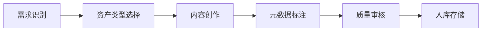
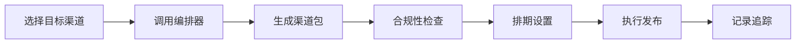
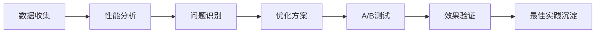

# GEO资产库内容操作系统说明书

## 版本信息
- 版本号：V1.0
- 发布日期：2025年1月
- 适用范围：全渠道内容运营团队

---

## 一、系统概述

### 1.1 系统定位
GEO资产库是一套全渠道内容操作系统，通过"标准化资产 + 分发API + 监听回流"三大核心机制，实现同一份答案在全渠道的统一调用、引用和执行。

### 1.2 核心价值
- **内容资产化**：将分散的内容转化为可复用的标准化资产
- **渠道自动化**：一次创作，多渠道自动分发
- **效果可视化**：全链路数据监测与效果归因
- **迭代智能化**：基于数据反馈的持续优化

### 1.3 系统架构
```
┌─────────────────────────────────────────────┐
│             GEO资产库中台                    │
├─────────────────────────────────────────────┤
│  建库 → 编排 → 分发 → 承接 → 回流 → 优化    │
└─────────────────────────────────────────────┘
```

---

## 二、功能模块详解

### 2.1 建库模块 - 资产标准化中心

#### 2.1.1 资产类型定义（10类标准资产）

| 资产类型 | 应用场景 | 格式要求 | 字数范围 |
|---------|---------|---------|---------|
| FAQ卡 | 常见问题解答 | Q&A结构 | 100-300字 |
| 步骤卡(How-to) | 操作指南 | 编号步骤 | 200-500字 |
| 对比/清单卡 | 产品比较 | 表格/列表 | 300-800字 |
| TL;DR摘要卡 | 快速概览 | 要点提炼 | 50-150字 |
| 实测数据卡 | 性能展示 | 数据+图表 | 200-400字 |
| 评测/背书卡 | 信任建立 | 引用+来源 | 150-300字 |
| 讨论串底稿 | 社区互动 | 对话格式 | 500-1500字 |
| AMA脚本 | 问答直播 | 主题分组 | 1000-3000字 |
| 章节化视频脚本 | 视频内容 | 时间轴标注 | 1500-5000字 |
| 任务调用卡 | 转化引导 | CTA+链接 | 50-100字 |

#### 2.1.2 元数据管理规范

**必填字段**
- 资产ID（自动生成）
- 主题/用户意图
- 关键词簇（3-10个）
- 适配渠道列表
- 创建时间/更新时间
- 版本号

**选填字段**
- 语言/地区标识
- 证据强度（1-5级）
- 作者实体信息（E-E-A-T）
- AAO评分（AI优化评分）
- 引用次数统计
- 转化指标追踪
- 互链关系映射

#### 2.1.3 渠道适配规范库

**规范内容包含**
- 字符长度限制
- 标签使用规则
- 格式化要求
- 禁忌词汇清单
- 示例模板库

### 2.2 编排模块 - 智能内容组装器

#### 2.2.1 编排工作流

```
用户意图识别 → 资产组件选择 → 渠道模板匹配 → 内容自动生成
```

#### 2.2.2 自动化产物清单

| 渠道类型 | 输出格式 | 包含元素 |
|---------|---------|---------|
| Reddit/Quora | 结构化问答帖 | 标题+正文+引用 |
| Medium/LinkedIn | 深度长文 | 导语+章节+总结 |
| YouTube | 视频描述包 | 章节时间轴+TL;DR |
| 官网FAQ | HTML片段 | Schema标注+锚点 |
| Pinterest | 图文卡片 | 图片规格+文案 |
| Amazon Q&A | 标准回复 | 产品关联+证据 |
| EDM/IM | 快捷模板 | 变量标记+CTA |

### 2.3 分发模块 - 多渠道发布中心

#### 2.3.1 分发方式分类

**A. API直连渠道**
- YouTube Data API
- Medium Publishing API
- Twitter/X API
- LinkedIn Share API
- Shopify Blog API
- 知识库系统API

**B. 半自动发布渠道**
- Reddit（发布包+操作指南）
- Quora（模板+人工审核）
- 垂直论坛（脚本辅助）

**C. 广告投放接口**
- Google Ads（搜索/Performance Max）
- Meta Ads Manager
- TikTok for Business
- Amazon Advertising

#### 2.3.2 任务编排器功能

- 可视化流程设计
- 批量任务调度
- 审核节点配置
- 发布时间管理
- 失败重试机制
- 发布日志记录

### 2.4 承接模块 - 私域转化系统

#### 2.4.1 Action Card配置

**标准动作类型**
- 免费试用申请
- 产品演示预约
- 直接下单购买
- 专家咨询对接
- 资料下载获取
- 社群加入邀请

#### 2.4.2 系统集成清单

- WhatsApp Business API
- Facebook Messenger
- 网站在线客服系统
- EDM营销平台
- CRM系统对接
- 订单管理系统

### 2.5 回流模块 - 数据监测分析台

#### 2.5.1 数据采集维度

**内容表现指标**
- AI引擎引用率
- 搜索结果排名
- 品牌词覆盖度
- 内容抓取频次

**用户互动指标**
- 页面停留时长
- 评论参与深度
- 内容保存/分享率
- 点击转化路径

**业务价值指标**
- 线索生成数量
- 私域导流效率
- 成交转化率
- 客户获取成本

#### 2.5.2 监测看板配置

**三大数据切片**
1. 渠道维度分析
2. 意图维度分析
3. 资产维度分析

**智能标注系统**
- 高贡献资产标记
- 失效内容预警
- 待更新资产提醒

### 2.6 优化模块 - 生命周期管理器

#### 2.6.1 资产生命周期

```
新建期 → 观察期 → 成熟期 → 衰退期 → 归档/重制
  ↓        ↓         ↓         ↓          ↓
(7天)    (30天)   (90天+)   (180天+)   (决策)
```

#### 2.6.2 A/B测试框架

**测试维度**
- 标题优化测试
- 文案句式对比
- CTA按钮文案
- 内容结构调整
- 视觉元素变化

#### 2.6.3 E-E-A-T强化策略

- 作者资质展示页
- 第三方认证徽章
- 媒体报道链接库
- 用户评价精选区
- 跨平台信息一致性校验

---

## 三、操作流程指南

### 3.1 内容创建流程



### 3.2 渠道发布流程



### 3.3 数据优化流程



---

## 四、系统部署架构

### 4.1 技术架构图

```
┌────────────────────────────────────────────┐
│              前端展示层                      │
│  (管理后台 / 数据看板 / 编排工具)            │
├────────────────────────────────────────────┤
│              应用服务层                      │
│  (业务逻辑 / API网关 / 任务调度)            │
├────────────────────────────────────────────┤
│              数据中台层                      │
│  (DAM系统 / 数据仓库 / AI引擎)             │
├────────────────────────────────────────────┤
│              基础设施层                      │
│  (云服务 / CDN / 存储 / 安全)              │
└────────────────────────────────────────────┘
```

### 4.2 角色权限矩阵

| 角色 | 建库 | 编排 | 分发 | 监测 | 优化 |
|-----|-----|-----|-----|-----|-----|
| 超级管理员 | ✓ | ✓ | ✓ | ✓ | ✓ |
| 内容运营 | ✓ | ✓ | ✓ | ✓ | - |
| 渠道专员 | - | ✓ | ✓ | ✓ | - |
| 数据分析师 | - | - | - | ✓ | ✓ |
| 外部合作方 | - | - | ✓ | - | - |

### 4.3 系统集成接口

**输入接口**
- 内容管理系统(CMS)
- 产品信息管理(PIM)
- 客户数据平台(CDP)

**输出接口**
- 社交媒体平台API
- 广告投放平台
- 客服系统
- 数据分析平台

---

## 五、实施计划（90天）

### 第1阶段（0-30天）：基础建设
- [ ] 完成10类资产标准定义
- [ ] 搭建DAM基础字段体系
- [ ] 制作3个渠道模板（Reddit/YouTube/FAQ）
- [ ] 完成系统基础架构部署

### 第2阶段（31-60天）：渠道接入
- [ ] 接入5个API直连渠道
- [ ] 制定手动发布SOP
- [ ] 完成私域系统对接
- [ ] 上线Action Card功能

### 第3阶段（61-90天）：数据闭环
- [ ] 部署监测看板系统
- [ ] 启动A/B测试机制
- [ ] 建立资产生命周期管理
- [ ] 完成首轮优化迭代

---

## 六、关键绩效指标(KPI)

### 6.1 资产级KPI
- AI引用率 ≥ 30%
- 平均引用次数 ≥ 50次/月
- 资产转化率 ≥ 5%
- 更新周期 ≤ 90天

### 6.2 主题级KPI
- 搜索首屏覆盖率 ≥ 60%
- 跨渠道一致性 ≥ 95%
- UGC扩散率 ≥ 20%

### 6.3 渠道级KPI
- 互动率提升 ≥ 30%
- 私域导流率 ≥ 10%
- CAC降低 ≥ 25%
- LTV/CAC比值 ≥ 3:1

---

## 七、运维管理规范

### 7.1 日常运维任务
- **每日**：监控发布状态、处理异常告警
- **每周**：资产性能报告、渠道效果分析
- **每月**：资产库盘点、优化建议输出
- **每季**：系统升级评估、策略调整会议

### 7.2 应急响应机制
- 一级事故（系统宕机）：15分钟内响应
- 二级事故（功能异常）：30分钟内响应
- 三级事故（数据偏差）：2小时内响应

### 7.3 培训认证体系
- 新人培训：16课时基础培训
- 进阶认证：渠道专家/数据专家认证
- 持续教育：每月最佳实践分享会

---

## 八、附录

### 附录A：术语表
- **GEO**：Generative Engine Optimization，生成式引擎优化
- **DAM**：Digital Asset Management，数字资产管理
- **AAO**：AI Answer Optimization，AI答案优化
- **E-E-A-T**：Experience, Expertise, Authoritativeness, Trustworthiness
- **CTA**：Call To Action，行动召唤
- **SOP**：Standard Operating Procedure，标准操作程序

### 附录B：常见问题FAQ
1. **Q: 如何判断资产需要更新？**
   A: 系统会根据时效性、引用率下降、用户反馈等多维度自动触发更新提醒。

2. **Q: 不同渠道的内容会不会重复？**
   A: 系统会根据各渠道特性自动调整内容形式，确保差异化呈现。

3. **Q: 如何保证内容质量？**
   A: 通过模板规范、自动校验、人工审核三重保障机制。

### 附录C：联系方式
- 系统支持：support@geo-system.com
- 培训咨询：training@geo-system.com
- 技术文档：docs.geo-system.com

---

## 更新日志

| 版本 | 日期 | 更新内容 |
|------|------|---------|
| V1.0 | 2025-01 | 初始版本发布 |

---

*本说明书最终解释权归GEO资产库运营团队所有*